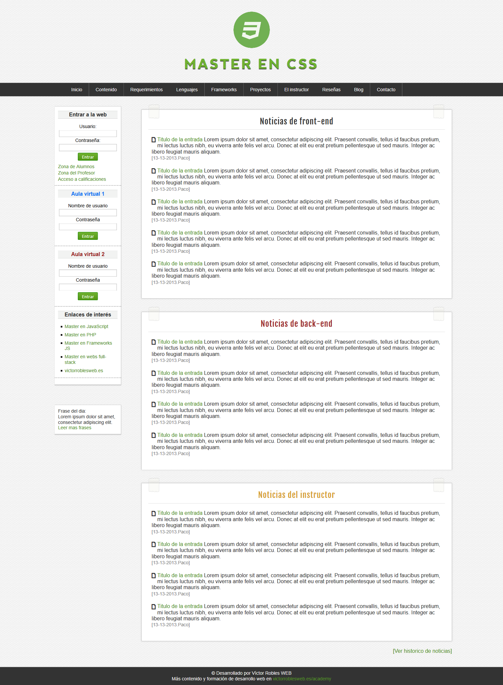

# Maqueta CSS

## Descripción general

Modelo de una página web realizada con HTML y CSS

### Las principales herramientas y tecnologías utilizadas incluyeron:

- HTML5
- CSS  

### Visita el sitio web:

- [cssmockup.github.io](https://roraima1986.github.io/cssmockup.github.io/)